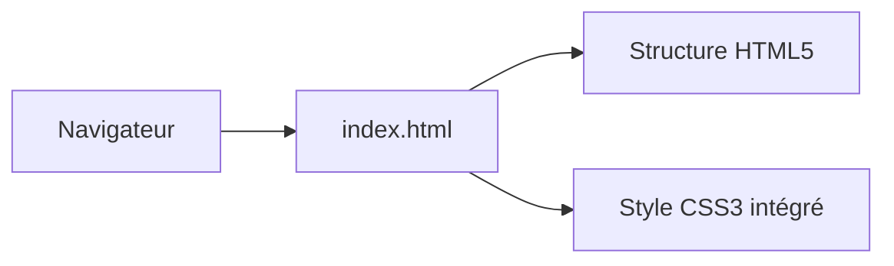

# Squishy Dumplings

Ce projet est un site vitrine simple, élégant et anti-stress pour vendre des squishies en forme de dumplings.


## Prérequis
- Un navigateur web récent (Chrome, Firefox, Safari)

## Installation
```bash
git clone https://github.com/elasnier/eval-collab-Edgar.git
cd eval-collab-Edgar
```

## Usage
Il s'agit d'un site statique. Ouvrez simplement le fichier `index.html` dans votre navigateur pour visualiser la maquette, ou utilisez une extension comme Live Server.

## Configuration
Le projet ne nécessite aucune variable d'environnement ni fichier de configuration externe. Les couleurs principales sont configurées via des variables CSS (`:root`) directement dans le fichier `index.html`.

## Architecture
Le projet est composé d'un unique fichier `index.html` qui embarque la structure sémantique et le style CSS (design responsif, flexbox, grid).



*Consultez nos décisions techniques dans le dossier [docs/adr/](docs/adr/).*

## Contribution
- Modèle de branche : GitHub Flow (créez des branches courtes `feature/` ou `fix/`).
- Commits : Format **Conventional Commits** exigé (ex: `feat(ui): ajoute...`).
- Pour plus de détails, consultez CONTRIBUTING.md (s'il existe).

## Licence & contacts
Projet maintenu par l'équipe Squishy Dumplings. En cas de problème ou de question, merci d'ouvrir une *Issue* sur GitHub.
